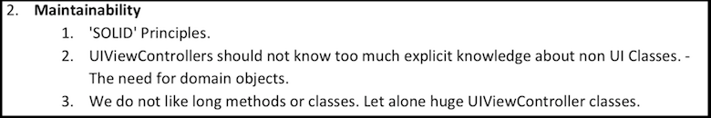
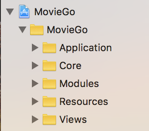
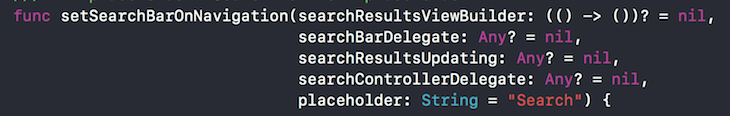
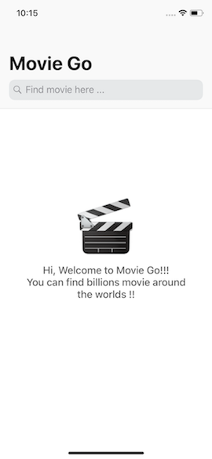
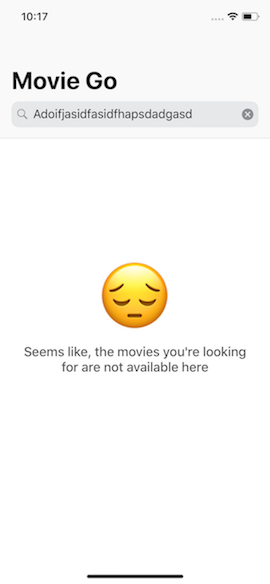

**DISCLAIMER: For better experience, make sure open this readme file with markdown viewer because there would be a lot of images :D**

# MovieGo

MovieGo is the codename of this project :D
This project is built in clean architecture with SOLID Principle. 

## Architecture
Everyone is comparing architectures, but that's not what people should do. As far as I can see, an MVP is good for a small app with a few screens. But let's take a look to the assignment number two **Maintainability**



Let's assume that this project will be real big project. Then yes! the real problem starts if your app grows and more and more components get into the game. So I choose Viper as a design pattern for this project to achieve this requirement.

## Project
Let's take a look to the picture above (again). I'm assuming that this project is initial project for a growing company. So I have to start this project with **Non Monolithic** workplace to cut off technical debt in the future as well. This project is seperated by 3 projects namely, `Api`, `Storage`, and `MovieGo`:

 **1. Api** - All about api requests are placed here

 **2. Storage** - All about device database management
 
 **3. MovieGo** - The main module a.k.a our apps, or we may say **The Launcher** !!
 

## Module Generator
As we all know, Viper is a design pattern that implements ‘separation of concern’ paradigm. Mostly like MVP or MVC it follows a modular approach. One feature, one module. For each module VIPER has five (sometimes four) different classes with distinct roles. They are `View`, `Presenter`, `Interactor`, `Router`, and `Entity`.

Never start to create a VIPER project by hand, you should always use a code generator, because you'll need lots of boilerplate code for each module. There are many generator solutions, but I made my own little Swift script, which completely simple. But i made it with a reason.

> I build a generator base on my needs *(read: my application company needs)

Here is **ModuleGenerator.swift** on the project. Just fire it up with this command
```
./ModuleGenerator.swift <Directory/ModuleName> <BaseViewController you want to conform>
```
It'll generate a module template with the given name in the current directory.

## Api Target Overview

**Purpose**

Separating Api Target from the **monolitic app** for me is great idea. Api have versioning stuff and following it is such a hell. Sometimes **(really often in real life)**  1 application need to call different version of Endpoint, so instead of maintain the helper class, we can just create 1 target for 1 version of Api. This strategy also accomodate the adaption of changing of our api, if we need to change all or some of our endpoint, you know what should we do without messing up another stuff.

**Unit Test**

Api is the most important element in the app, so the unit test strategy here is doing real call once and stub the rest. Api stubbing also has a strategy, we have to make sure we mock and stub our api base on the documentation. For me? Okay I don't have the documentation so my strategy was call all posibility response from 1 endpoint you gave me and put it on my **Unit Test**.

___
## Storage Target Overview
**Purpose**

Okay a lot of features are comming in for iOS,  that's why we need to have our seperated storage management just in case we would change our Database system. You may say, we can still do this (change database system) on our main app but, **Can you imagine the conflicts ?** and **How many line of code would be affected by this ?**. So with separating target, we can only change our internal target code without messing up the public api.

**Unit Test**

Yes, I use **In Memory** type of core data to do unit testing because I dont want to mess up my current saved data. The purposes of unit test here are knowing CRUD function works perfectly and syncronusly.
___

## MovieGo Target Overview

**Structures**

Okay, let's take a look the foldering stuff of MovieGo target. I seperate MovieGo into 4 main folders.

 1. **Application** - All about application level management (AppDelegate). Why ? it's only 1 class! Okay, let's take a look to all methods inside AppDelegate, this is super complex.. You may add remote notification handler, setup key, user activity handler, and a lot more complexity in the real world. So yaps. preparing for the complexity from a very beginning is not a crime :)
 2. **Core** - This folder is to accomodate helpers, managers, global constants, or we may say base type stuff!!
 3. **Modules** - The modules in the target (the apps itself)
 4. **Resources** - All about target resources without 3 classifications above :D
 5. **Views** - The more engineers and designers we have, the more unconsistent design we would have <span style="color:red">(IF WE DON'T HAVE GOOD PRODUCT DESIGN PRINCIPLE)</span>. Yaps in this case, I adopt one of principle from [atomic design](http://atomicdesign.bradfrost.com) by brad forst.  `Every single view should be reusable`.  So that, I group all views in the one place


**Highlighted Code Snippet**

Why I made `BaseTableViewController` ? Yaps, it's a part of my sense of long term vision. Have you ever think that someday business requirement changes our app radically? So .... instead of doing massive refactoring with copy paste stuff, why don't we prepare a base controller to simplify our job? Of course! since it's only for an assignment, I only create 1 base controllers. But in the real life, we should *"Base-rized"* all of controllers


Why use a builder callback for a `SearchResultsViewController` while we may use direct assign to our `UISearchController` ? In SOLID Principle, we have to separate responsibility of each class. There is `Router` that responsible to routing stuff.


Find out `UIColor.swift`  and `UIFont.swift` files and you may be amazed why do I made this overkill stuff just for 1 - 2 kinds of them. The answer is as easy as the previous one, it would be very easy to refactor someday.

Separating `DataSource` file ? Okay we all know that `UITableView DataSource` is data that related to View and we may put it on the view. But.... in Single Responsible principle (**S**OLID), we every class has single type of responsibility.. That's why I separate `DataSource` in a class.


**Unit Test**

Implementing SOLID principle with VIPER, make us easier to increase our unit testing coverage. Okay for the first step, if we are run out of time, just make sure we are testing our `Interactor` because it responsible to "business logic".  We can also mock each of our components to test the real one. For example`MockInteractor` , `MockViewController` to test `Presenter`. For me? Sure! I do run out of time, so I just test the `Interactor` component of the module :D.

___

## User Experience Overview
Finally, I reach this part :D. In general, I use iOS standard user interface to solve this assessment. But my background is Core Design Squad, so the UI should work for you as well :D. 

**1. Initial Screen**



It is fun, I use purely iOS elements to build this app including the welcome part :D

**2. Searching Screen**


Okay, wait! Don't let our user wait with no information. So let them know what they waiting for.

**3. Movie List Screen**


Voila! the movies you are looking for are on the list

**4. Error Screen**




"What happen!!! My app is showing nothing!! this is s*cks!!!" Don't let our user swearing like that! So provide the error information to them! *Ups.. I mean "to them."

**5. Toast Warning**


Most user dont like disturbing alert, so just let them know in the elegant way.
***
Huft.. That'all my explanation about my assessment, It was exausting but very fun. Hope this match your expectation.

Ahh yah.. about **UI Test**. Wait! It's only a week dude!! And don't we have a software engineer in test nowadays :D. Haha nevermind, Thanks! good luck for me..


Best,
Azisseno
